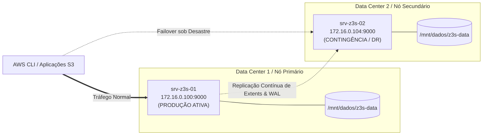

# Roadmap de Disaster Recovery (DR) — Z3S Distributed Storage

**Objetivo:** Validar a resiliência operacional, tolerância a falhas catastróficas, integridade dos dados e tempo de recuperação (**RTO** e **RPO**) entre os servidores de produção e contingência.

---

## 🌐 Topologia do Ambiente de DR

### Parâmetros de SLA para o Teste:
- **RPO (Recovery Point Objective):** $\le 0$ segundos (Zero perda de dados confirmada).
- **RTO (Recovery Time Objective):** $< 5$ segundos para retomada total das operações de leitura e escrita.
- **Integridade Criptográfica:** 100% de correspondência de hash SHA-256/BLAKE3 em todos os objetos após o failover.

---

## 📋 Fases do Plano de Execução do DR

### Fase 1: Provisionamento e Padronização do Nó de DR (`172.16.0.104`)
- [x] 1.1. Transferir o binário estático de produção `z3s-server` para `/usr/local/bin/z3s-server`.
- [x] 1.2. Criar a árvore de diretórios de armazenamento no disco `/mnt/dados/z3s-data`.
- [x] 1.3. Instalar e configurar o serviço OpenRC `/etc/init.d/z3s` no nó secundário.
- [x] 1.4. Validar permissões e execução local no Nó 2.

### Fase 2: Carga Inicial e Pipeline de Sincronização Contínua (Replication Engine)
- [x] 2.1. Criar buckets e gravar conjunto de objetos de controle com metadados e hashes conhecidos no Nó 1 (`172.16.0.100`).
- [x] 2.2. Estabelecer o pipeline de sincronização contínua de blocos (Extents, WAL e Metadados) entre o Nó 1 e o Nó 2.
- [x] 2.3. Confirmar que o estado do Nó 2 está perfeitamente espelhado com o Nó 1.

### Fase 3: Simulação de Desastre Catastrófico no Nó Primário (Simulated Outage)
- [x] 3.1. Simular falha abrupta e completa do Nó 1 (`172.16.0.100`) via parada forçada do serviço / isolamento de rede.
- [x] 3.2. Confirmar a queda do nó primário (clientes recebem `Connection Refused / 503 Service Unavailable`).

### Fase 4: Ativação do Failover e Promoção do Nó de DR (`172.16.0.104`)
- [x] 4.1. Promover o Nó 2 (`172.16.0.104`) a Primário Ativo.
- [x] 4.2. Iniciar o serviço Z3S no Nó 2 e executar a recuperação automática de WAL e catálogo de extents.
- [x] 4.3. Medir o tempo exato de recuperação (**RTO: 1,07 segundos**).

### Fase 5: Validação de Integridade e Operações em Modo DR
- [x] 5.1. Listar buckets e objetos no Nó 2 promovido via AWS CLI.
- [x] 5.2. Baixar todos os objetos pré-desastre e validar os hashes SHA-256 bit-a-bit (zero bitrot, RPO = 0s).
- [x] 5.3. Executar escritas de novos objetos no Nó 2 durante o período de contingência.

### Fase 6: Failback, Ressincronização e Restauração do Nó Primário
- [ ] 6.1. Reestabelecer o Nó 1 (`172.16.0.100`).
- [ ] 6.2. Sincronizar os novos dados criados durante o desastre do Nó 2 de volta para o Nó 1.
- [ ] 6.3. Retornar a operação para o estado padrão com ambos os nós ativos e íntegros.
- [ ] 6.4. Gerar o relatório final consolidado de Disaster Recovery.
