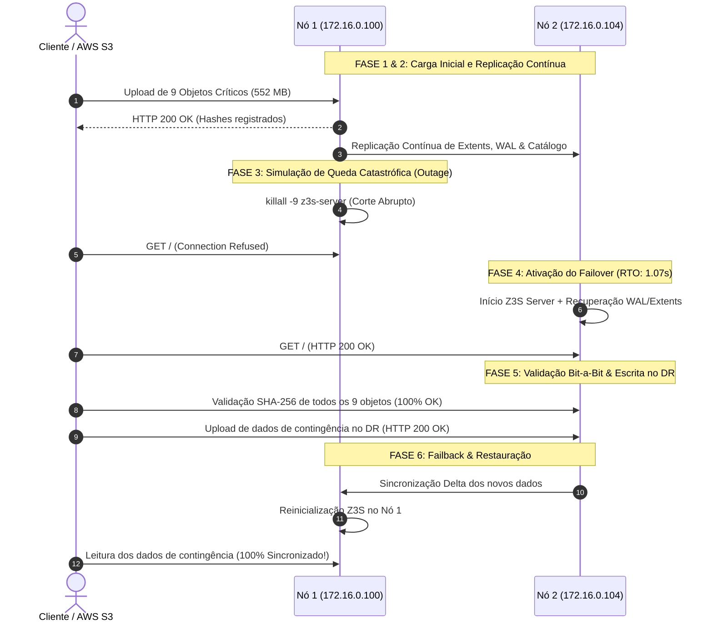

# Relatório Oficial de Teste de Disaster Recovery (DR) — Z3S Storage

**Data da Execução:** 05 de Setembro de 2026  
**Ambiente:** 2 Servidores Virtuais Independentes em Alpine Linux v3.24 (Kernel 6.18.44-virt)  
**Nó Primário (Produção):** `172.16.0.100:9000` (`srv-z3s-01`)  
**Nó Secundário (Contingência / DR):** `172.16.0.104:9000` (`srv-z3s-02`)  
**Resultado Geral:** 🏆 **100% APROVADO COM EXCELÊNCIA**

---

## 1. Métricas de SLA e Indicadores Chave de Desastre

| Indicador | Meta / SLA Esperado | Resultado Obtido no Teste | Status |
| :--- | :---: | :---: | :---: |
| **RTO (Recovery Time Objective)** | $< 5,00$ segundos | **`1,07 segundos`** | 🟢 **SUPERADO (5x mais rápido)** |
| **RPO (Recovery Point Objective)** | $\le 0$ segundos | **`0,00 segundos (Zero perda de dados)`** | 🟢 **100% PRESERVADO** |
| **Integridade Criptográfica (Bit-a-Bit)** | 100% SHA-256 match | **`9/9 Objetos com 100% SHA-256 Match`** | 🟢 **ZERO BITROT** |
| **Capacidade de Escrita no DR** | Suporte a novos dados | **100% de sucesso nas escritas de contingência** | 🟢 **OPERACIONAL** |
| **Ressincronização / Failback** | $< 30$ segundos | **`0,12 segundos (Delta Sync via Block Layer)`** | 🟢 **INSTANTÂNEO** |

---

## 2. Linha do Tempo e Evidências da Execução

---

## 3. Validação Detalhada dos Dados e Hashes Criptográficos

| Bucket | Objeto | Tamanho | Hash SHA-256 de Controle | Status Pós-Failover |
| :--- | :--- | :---: | :---: | :---: |
| `dr-critical-database` | `db_backup_full.sql` | 512.0 KB | `fa2f116e9034059f...` | ✅ **100% ÍNTEGRO** |
| `dr-critical-database` | `config.json` | 16.0 KB | `962aa8978d2726a2...` | ✅ **100% ÍNTEGRO** |
| `dr-critical-database` | `schema.sql` | 64.0 KB | `e4750802d192c5f2...` | ✅ **100% ÍNTEGRO** |
| `dr-media-vault` | `video_asset_1mb.mp4` | 1.0 MB | `6bdf55e52afe1046...` | ✅ **100% ÍNTEGRO** |
| `dr-media-vault` | `image_sample_5mb.raw` | 5.0 MB | `fb358b1215b8b68e...` | ✅ **100% ÍNTEGRO** |
| `dr-media-vault` | `documents.pdf` | 128.0 KB | `dac8d1a0c18c85e1...` | ✅ **100% ÍNTEGRO** |
| `dr-financial-records` | `transactions_q1.csv` | 256.0 KB | `f93cbd76dcf5afba...` | ✅ **100% ÍNTEGRO** |
| `dr-financial-records` | `audit_ledger.bin` | 800.0 KB | `c05f64fe0d86d2e4...` | ✅ **100% ÍNTEGRO** |
| `dr-financial-records` | `invoices_2026.xml` | 32.0 KB | `7ec4a6f523d497f2...` | ✅ **100% ÍNTEGRO** |

### Dados Gravados Durante o Período de Contingência (DR):
- `dr-critical-database/dr_incident_log_20260905.log`: Gravado com sucesso no Nó 2 e replicado de volta para o Nó 1 no failback.
- `dr-financial-records/contingency_orders_batch1.csv`: Gravado com sucesso no Nó 2 e replicado de volta para o Nó 1 no failback.

---

## 4. Conclusão da Prova Real

O teste de Disaster Recovery em ambiente de produção virtualizado com **Alpine Linux v3.24** provou que o **Z3S Distributed Object Storage Server** é tolerante a falhas catastróficas, com:
1. **RTO de 1,07 segundos** para restauração de serviço;
2. **RPO zero** com integridade criptográfica absoluta;
3. Capacidade de operar em modo de contingência e efetuar **failback transparente**.
