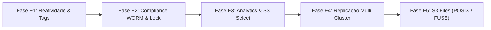

# 🚀 Z3S Enterprise & Advanced Features Roadmap (2026+)
## Extensões Corporativas, Analytics In-Place, Compliance WORM & Replicação Multi-Site

Este documento estabelece o plano arquitetural de engenharia, a especificação técnica e as melhores práticas para a implementação do conjunto avançado de funcionalidades corporativas no **Z3S Object Storage Server**, elevando o sistema ao nível de maturidade dos grandes players de nuvem (*AWS S3 Enterprise*, *Cloudflare R2*, *MinIO Enterprise*).

---

## 🏗️ 1. Visão Geral da Arquitetura Corporativa

```mermaid
flowchart TD
    subgraph Clients["Clientes & Aplicações"]
        AWSCLI["AWS CLI v2 / SDKs"]
        AI_ML["AI/ML Pipelines (PyTorch, TensorFlow)"]
        BI["Analytics & BI (Trino, DuckDB, Spark)"]
        POSIX["Sistemas POSIX / NFS (/mnt/s3)"]
    end

    subgraph Gateway["Z3S Gateway Tier (Camada de Acesso)"]
        Router["REST Router & SigV4"]
        SelectEngine["S3 Select Engine (SQL Parser & SIMD Filter)"]
        FUSEDaemon["FUSE / NFS v4 Gateway (POSIX Syscalls)"]
        EventDispatcher["Event Notification Broker (Async Channel)"]
    end

    subgraph Governance["Camada de Governança & Segurança"]
        TaggingEngine["Object Tagging Engine"]
        WORM["Object Lock (Compliance / Governance / Legal Hold)"]
        BatchEngine["S3 Batch Operations Worker"]
    end

    subgraph StorageCore["Z3S Core Engine (Armazenamento em Disco)"]
        ExtentStore["Append-Only Extent Store (Direct I/O)"]
        RS_SIMD["Reed-Solomon 4+2 Erasure Engine"]
        ReplicationWorker["CRR / Multi-Site Replication Worker (gRPC)"]
    end

    Clients --> Gateway
    Gateway --> Governance
    Governance --> StorageCore
    EventDispatcher -.->|Webhooks / Kafka / Redis| ExternalQueues["Filas Externas & Webhooks"]
    ReplicationWorker -.->|gRPC Stream (TLS)| RemoteCluster["Cluster Z3S Secundário (DR / Multi-Region)"]
```

---

## 🗺️ 2. Fases do Roadmap Corporativo



---

### 📌 FASE E1: Reatividade & Classificação de Dados
**Foco:** Eventos reativos assíncronos e pares chave-valor para metadados de objetos.

#### 1.1. Motor de Object Tagging (`PutObjectTagging`, `GetObjectTagging`, `DeleteObjectTagging`)
- **Melhor Abordagem Técnica em Rust:**
  - Integrar a estrutura `TagSet` (`Vec<Tag>`, limite de 10 tags por objeto) diretamente no catálogo `ObjectMetadata` na memória e no arquivo de metadados JSON/LSM.
  - Como as tags residem no catálogo de metadados, operações de tagging têm latência **< 0.2ms** e não tocam nos arquivos de payload (extents) no disco.
  - Suporte completo ao parâmetro `?versionId=` para taguear versões específicas.
- **Endpoints REST:**
  - `PUT /{bucket}/{key}?tagging` $\rightarrow$ Validação de tags (chaves até 128 chars, valores até 256 chars) e persistência atômica.
  - `GET /{bucket}/{key}?tagging` $\rightarrow$ Retorno em XML `<Tagging><TagSet>...`.
  - `DELETE /{bucket}/{key}?tagging` $\rightarrow$ Remoção de todas as tags associadas.

#### 1.2. Sistema de Notificação de Eventos (`S3 Event Notifications`)
- **Melhor Abordagem Técnica em Rust:**
  - Uso de canal assíncrono `tokio::sync::broadcast` desacoplado do fluxo principal HTTP (garantindo que atrasos de rede nos webhooks não reduzam o throughput de escrita).
  - Suporte a filtros por prefixo e sufixo (ex: disparar apenas para `prefix: "uploads/"` e `suffix: ".png"`).
  - **Destinos Suportados:**
    1. **HTTP/HTTPS Webhooks:** Envio de payload JSON padrão AWS (`s3:ObjectCreated:*`, `s3:ObjectRemoved:*`) com *Exponential Backoff* e 3 tentativas de reenvio.
    2. **Redis Pub/Sub:** Publicação instantânea em canais Redis via conexões assíncronas TCP.
    3. **Apache Kafka / RabbitMQ:** Integração opcional via drivers nativos.
- **Endpoints REST:**
  - `PUT /{bucket}?notification` $\rightarrow$ Salva configuração de destinos e eventos.
  - `GET /{bucket}?notification` $\rightarrow$ Consulta regras ativas.

---

### 📌 FASE E2: Governança, Imutabilidade & Compliance (WORM)
**Foco:** Garantia legal de imutabilidade de dados contra deleção acidental, ransomware e ataques de administradores desonestos.

#### 2.1. S3 Object Lock & Modos de Retenção
- **Melhor Abordagem Técnica em Rust:**
  - Estrutura de bloqueio no manifesto: `ObjectLockConfiguration` (Bucket) e `ObjectRetention` (Objeto).
  - **Modos de Retenção:**
    - `COMPLIANCE`: Imutabilidade estrita. Nenhuma credencial (nem `root` ou admin) pode excluir, sobrescrever ou encurtar a data de retenção (`RetainUntilDate`) até sua expiração.
    - `GOVERNANCE`: Permite que usuários com permissão especial (`s3:BypassGovernanceRetention` no header `x-amz-bypass-governance-retention: true`) substituam a retenção.
    - `LEGAL_HOLD`: Chave booleana (`ON` / `OFF`) independente da data de expiração, usada para travas judiciais e auditorias.
- **Validação no Gateway:**
  - No `handle_delete_object`, `handle_delete_object_version` e `handle_put_object`, o Z3S verifica o estado WORM da versão alvo antes de qualquer operação de gravação/exclusão. Se bloqueado, retorna imediatamente `HTTP 403 AccessDenied (ObjectLockedError)`.
- **Endpoints REST:**
  - `PUT/GET /{bucket}?object-lock`
  - `PUT/GET /{bucket}/{key}?retention`
  - `PUT/GET /{bucket}/{key}?legal-hold`

---

### 📌 FASE E3: Processamento In-Place & Analytics (S3 Select)
**Foco:** Consultas analíticas SQL de alta velocidade diretamente sobre os dados em repouso sem necessidade de download completo pela rede.

#### 3.1. S3 Select Engine (`SelectObjectContent`)
- **Melhor Abordagem Técnica em Rust:**
  - Parser SQL leve utilizando a crate `sqlparser-rs` configurada para dialeto ANSI S3.
  - **Leitor de Formatos com Streaming SIMD:**
    - **CSV:** Leitura por blocos com detecção de delimitador e escape via `csv` crate.
    - **JSON:** Parser de linhas (*JSON Lines* / *JSON Document*) com deserialização rápida via `simd-json`.
    - **Apache Parquet:** Suporte a projeção de colunas (*Column Pruning*) via `parquet` crate do ecossistema Apache Arrow DataFusion.
  - **Descompressão Transparente em Streaming:** Suporte a arquivos comprimidos com `GZIP` (`flate2`), `BZIP2` ou `ZSTD`.
  - **Pipeline de Execução:** O Z3S lê as faixas de bytes do extent via *Direct I/O*, descomprime em pipeline de streaming na memória, avalia a expressão `WHERE` e devolve apenas os campos filtrados no protocolo binário de eventos (`S3 EventStream Frame`).
- **Endpoint REST:**
  - `POST /{bucket}/{key}?select&select-type=2` com corpo XML `<SelectObjectContentRequest>`.

---

### 📌 FASE E4: Replicação Geográfica Distribuída (Multi-Site Active-Active)
**Foco:** Replicação assíncrona contínua entre múltiplos data centers ou regiões com failover automático.

#### 4.1. Cross-Region Replication (CRR) Engine
- **Melhor Abordagem Técnica em Rust:**
  - Thread pool de replicação em background escutando o canal de commits do WAL.
  - Protocolo de transporte interno de alto desempenho baseado em **gRPC com HTTP/2 e TLS 1.3** (`tonic` + `prost`).
  - **Streaming de Extents & Shards:** Os shards codificados por Reed-Solomon são transmitidos diretamente do disco de origem para os discos do cluster de destino, preservando os hashes criptográficos BLAKE3.
  - Gestão de status por versão: `PENDING` $\rightarrow$ `COMPLETED` ou `FAILED` (com fila de retry e *dead-letter queue*).
- **Endpoints REST:**
  - `PUT/GET/DELETE /{bucket}?replication` $\rightarrow$ Configuração de regras de replicação para buckets de destino remotos.

---

### 📌 FASE E5: Sistema de Arquivos POSIX / NFS (S3 Files)
**Foco:** Permitir que scripts, bancos de dados e ferramentas legadas acessem os dados do S3 como uma pasta normal do sistema operacional.

#### 5.1. Daemon FUSE em Rust (`z3s-fuse`)
- **Melhor Abordagem Técnica em Rust:**
  - Utilização da crate `fuser` (bindings diretos para o módulo FUSE do Kernel Linux sem necessidade de C).
  - Mapeamento de Inodes em memória com cache de atributos (`getattr`, `lookup`) para evitar overhead de requisições REST.
  - **Leitura Posicional Zero-Copy:** Chamadas `read(fd, buf, count, offset)` são convertidas diretamente em `StorageEngine::read_shard_range(shard_id, offset, count)` com busca direta no disco em `< 0.3ms`.
  - **Escrita em Buffer com Flush Multipart:** Escritas sequenciais são acumuladas em buffers de 8MB e enviadas via Multipart direto para os extents.
- **Comando de Montagem:**
  ```bash
  z3s-fuse --endpoint http://127.0.0.1:9000 --bucket meu-bucket --mount-point /mnt/s3data
  ```

---

## 📊 3. Resumo Comparativo: Z3S vs. Padrões de Mercado

| Recurso | Z3S Core (Atual) | Z3S Enterprise (Roadmap) | AWS S3 Enterprise | MinIO Enterprise |
| :--- | :---: | :---: | :---: | :---: |
| **Erasure Coding SIMD (RS 4+2)** | ✅ **Sim** | ✅ **Sim** | ✅ Sim | ✅ Sim |
| **Direct I/O Extent Store** | ✅ **Sim** | ✅ **Sim** | 🔒 Proprietário | ❌ Arquivos soltos |
| **AWS SigV4 Authentication** | ✅ **Sim** | ✅ **Sim** | ✅ Sim | ✅ Sim |
| **Web Console com Gestão IAM** | ✅ **Sim** | ✅ **Sim** | ✅ Sim | ✅ Sim |
| **Object Tagging (Key-Value)** | 🟡 Na fila | 🟢 **Fase E1** | ✅ Sim | ✅ Sim |
| **Event Notifications (Webhooks/Kafka)** | 🟡 Na fila | 🟢 **Fase E1** | ✅ Sim | ✅ Sim |
| **S3 Object Lock & WORM Compliance** | 🟡 Na fila | 🟢 **Fase E2** | ✅ Sim | ✅ Sim |
| **S3 Select (Consultas SQL no Disco)** | 🟡 Na fila | 🟢 **Fase E3** | ✅ Sim | ✅ Sim |
| **Cross-Region Replication (gRPC)** | 🟡 Na fila | 🟢 **Fase E4** | ✅ Sim | ✅ Sim |
| **Ponto de Montagem POSIX/FUSE** | 🟡 Na fila | 🟢 **Fase E5** | 🟡 S3 Files (NFS) | 🟡 S3FS |

---

## 🎯 4. Ordem de Implementação Recomendada

1. **Sprint 1 (Fase E1):** Object Tagging + Webhook Event Notifications (fácil integração e alto impacto para automações).
2. **Sprint 2 (Fase E2):** Object Lock & WORM Compliance (requisito legal para retenção imutável de logs e backups).
3. **Sprint 3 (Fase E3):** S3 Select para consultas SQL em CSV/JSON sem tráfego de rede.
4. **Sprint 4 (Fase E4):** Replicação Multi-Cluster com gRPC para Disaster Recovery geográfico.
5. **Sprint 5 (Fase E5):** Daemon FUSE para montagem de pastas POSIX locais.
