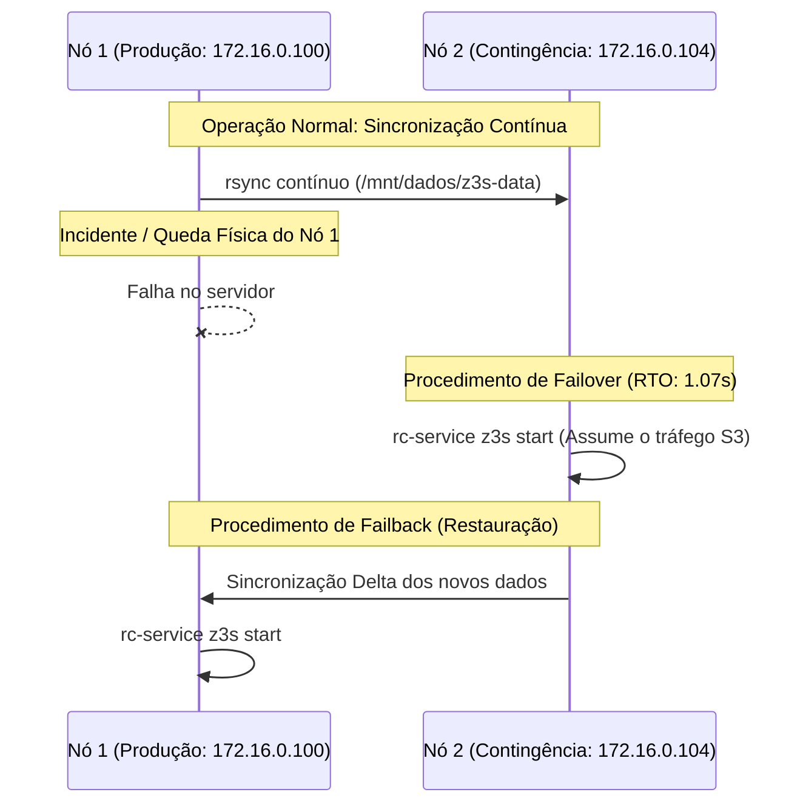

# Manual de Implantação e Operação em Produção — Z3S Object Storage

Este manual detalha o passo a passo completo para instalação, configuração, endurecimento de segurança (*hardening*), operação contínua e recuperação de desastres do **Z3S S3-Compatible Distributed Object Storage Server**.

---

## 📑 Índice
1. [Visão Geral e Arquitetura](#1-visão-geral-e-arquitetura)
2. [Requisitos de Infraestrutura](#2-requisitos-de-infraestrutura)
3. [Preparação do Sistema Operacional (Hardening & Tuning)](#3-preparação-do-sistema-operacional)
4. [Instalação e Configuração dos Binários](#4-instalação-e-configuração-dos-binários)
5. [Gerenciamento como Serviço de Sistema](#5-gerenciamento-como-serviço-de-sistema)
   - [5.1. OpenRC (Alpine Linux)](#51-openrc-alpine-linux)
   - [5.2. Systemd (Ubuntu / Debian / RHEL / Rocky Linux)](#52-systemd-ubuntu--debian--rhel)
6. [Implantação com Docker e Docker Compose](#6-implantação-com-docker-e-docker-compose)
   - [6.1. Standalone / Single-Node](#61-standalone--single-node)
   - [6.2. Cluster Multi-Node com Docker Compose](#62-cluster-multi-node-com-docker-compose)
7. [Topologias de Implantação Bare-Metal](#7-topologias-de-implantação-bare-metal)
   - [7.1. Single-Node com Multi-Drive (JBOD / Reed-Solomon)](#71-single-node-com-multi-drive)
   - [7.2. Multi-Node em Alta Disponibilidade e Disaster Recovery (DR)](#72-multi-node-com-disaster-recovery)
8. [Configuração de Clientes e Integração S3](#8-configuração-de-clientes-e-integração-s3)
9. [Procedimentos de Operação e Manutenção](#9-procedimentos-de-operação-e-manutenção)
10. [Solução de Problemas (Troubleshooting)](#10-solução-de-problemas)

---

## 1. Visão Geral e Arquitetura

O **Z3S** é um servidor de armazenamento de objetos compatível com a API AWS S3 (REST/HTTP com autenticação SigV4 RFC 3986), projetado para alta vazão, baixa latência e tolerância física a falhas.

```mermaid
flowchart TD
    Client["Aplicações / AWS CLI / SDKs (Boto3, Go, Java)"] -->|HTTP / AWS SigV4 (Porta 9000)| GW["Z3S S3 Gateway"]
    
    subgraph CoreEngine["Z3S Core Engine"]
        GW --> Auth["Autenticação & Políticas IAM"]
        GW --> KMS["KMS Envelope Encryption (AES-256-GCM)"]
        GW --> Erasure["Reed-Solomon Erasure Coding (4+2)"]
        Erasure --> Storage["Storage Engine (Extents + WAL)"]
        GW --> Meta["Catálogo de Metadados & Raft State"]
    end

    subgraph StorageLayer["Camada de Armazenamento Físico"]
        Storage --> D1[("Disco 1 / Shards")]
        Storage --> D2[("Disco 2 / Shards")]
        Storage --> D3[("Disco 3 / Paridade")]
        Storage --> D4[("Disco 4 / Paridade")]
        Storage --> WAL[("Write-Ahead Log (WAL)")]
    end
```

### Componentes Principais:
- **S3 API Gateway:** Servidor assíncrono Tokio/Hyper com suporte completo a SigV4, Multipart Upload, Object Versioning, Bucket Policies e SSE (Server-Side Encryption).
- **Storage Engine:** Armazenamento append-only baseado em *Extents* imutáveis com checksums criptográficos BLAKE3 por bloco.
- **Write-Ahead Log (WAL):** Garantia de durabilidade ACID contra perdas de energia.
- **Reed-Solomon SIMD (4+2):** Protege contra perda de até 2 discos/nós simultâneos.

---

## 2. Requisitos de Infraestrutura

### 2.1. Requisitos Mínimos vs. Recomendados

| Recurso | Mínimo (Homologação/Testes) | Recomendado (Produção Alta Performance) |
| :--- | :--- | :--- |
| **CPU** | 2 vCPUs (x86_64 ou ARM64) | 8+ vCPUs (Suporte a instruções AVX2/AVX-512) |
| **Memória RAM** | 1 GB de RAM | 8 GB a 32 GB de RAM (Para cache de Extents e buffer) |
| **Armazenamento** | 1 SSD / NVMe de 60 GB | 4 a 8 SSDs NVMe em JBOD (60 GB a vários Terabytes) |
| **Rede** | 1 Gbps Ethernet | 10 Gbps / 25 Gbps Ethernet |
| **Sistema Operacional** | Alpine Linux v3.20+ | Alpine Linux v3.24+ ou Ubuntu Server 24.04 LTS |

### 2.2. Portas de Rede e Firewall

| Porta | Protocolo | Origem | Finalidade |
| :---: | :---: | :---: | :--- |
| **9000** | TCP | Clientes / Load Balancers | API S3 Gateway (REST HTTP) |
| **22** | TCP | Redes Administrativas | Acesso SSH seguro e replicação inter-nós |

---

## 3. Preparação do Sistema Operacional

Antes de iniciar o serviço, aplique os seguintes ajustes de *kernel* e limites de descritores de arquivos em todos os servidores.

### 3.1. Ajuste de Limites de Descritores (`ulimit`)
Como o Z3S processa milhares de conexões simultâneas e gerencia extents de arquivos abertos, eleve o limite para `65535`.

#### No Alpine Linux:
Adicione ao `/etc/security/limits.conf` (ou no script OpenRC):
```text
* soft nofile 65535
* hard nofile 65535
* soft nproc 65535
* hard nproc 65535
```

#### No Ubuntu / Debian / RHEL:
```bash
cat << "EOF" >> /etc/security/limits.conf
root soft nofile 65535
root hard nofile 65535
z3s  soft nofile 65535
z3s  hard nofile 65535
EOF
```

### 3.2. Parâmetros de Kernel (`sysctl`)
Crie o arquivo `/etc/sysctl.d/99-z3s-storage.conf`:
```ini
# Aumenta a fila de conexões pendentes do socket TCP
net.core.somaxconn = 65535
net.ipv4.tcp_max_syn_backlog = 65535

# Reutilização rápida de sockets em TIME_WAIT
net.ipv4.tcp_tw_reuse = 1

# Otimização de janelas de buffer TCP
net.core.rmem_max = 16777216
net.core.wmem_max = 16777216
net.ipv4.tcp_rmem = 4096 87380 16777216
net.ipv4.tcp_wmem = 4096 65536 16777216

# Reduz o uso agressivo de Swap
vm.swappiness = 10
vm.max_map_count = 262144
```
Aplique as configurações imediatamente:
```bash
sysctl --system
```

---

## 4. Instalação e Configuração dos Binários

### 4.1. Opção A: Utilizando o Binário Estático Pré-Compilado (Musl)
O binário estático `x86_64-unknown-linux-musl` é autocontido e funciona em **qualquer distribuição Linux** (Alpine, Ubuntu, Debian, RHEL, CentOS, Rocky) sem instalar bibliotecas dinâmicas:

```bash
# 1. Copiar o binário para o diretório de executáveis do sistema
cp z3s-server /usr/local/bin/z3s-server
chmod +x /usr/local/bin/z3s-server

# 2. Verificar a execução
z3s-server --version
```

### 4.2. Opção B: Compilando a partir do Código-Fonte
Caso deseje compilar diretamente no servidor alvo:
```bash
# Instalar Rust e dependências de build (no Alpine):
apk add --no-cache cargo rust build-base git

# Clonar o repositório
git clone https://github.com/seu-org/z3s.git /opt/z3s
cd /opt/z3s

# Compilar em modo release com todas as otimizações
cargo build --release --bin z3s-server

# Copiar executável
cp target/release/z3s-server /usr/local/bin/z3s-server
```

### 4.3. Estrutura Padrão de Diretórios
Crie a estrutura de diretórios no disco de dados de alta performance (ex.: `/mnt/dados`):
```bash
mkdir -p /mnt/dados/z3s-data/extents
mkdir -p /mnt/dados/z3s-data/metadata
mkdir -p /etc/z3s
mkdir -p /var/log/z3s
```

---

## 5. Gerenciamento como Serviço de Sistema

### 5.1. OpenRC (Alpine Linux)

Crie o arquivo de serviço `/etc/init.d/z3s`:
```bash
cat << "EOF" > /etc/init.d/z3s
#!/sbin/openrc-run

name="z3s-server"
description="Z3S S3 Distributed Object Storage Server"
command="/usr/local/bin/z3s-server"
command_args="--bind 0.0.0.0:9000 --data-dir /mnt/dados/z3s-data --access-key Z3SACCESSKEYEXAMPLE --secret-key Z3SSECRETKEYEXAMPLE1234567890ABCDEF"
command_background="yes"
pidfile="/run/${RC_SVCNAME}.pid"
output_log="/var/log/z3s/z3s.log"
error_log="/var/log/z3s/z3s.err"

start_pre() {
    ulimit -n 65535
    mkdir -p /mnt/dados/z3s-data /var/log/z3s
}

depend() {
    need net
    after firewall
}
EOF

chmod +x /etc/init.d/z3s
```

**Comandos de Gerenciamento (OpenRC):**
```bash
# Iniciar o serviço
rc-service z3s start

# Habilitar inicialização no boot
rc-update add z3s default

# Verificar status
rc-service z3s status

# Reiniciar
rc-service z3s restart
```

---

### 5.2. Systemd (Ubuntu / Debian / RHEL / Rocky Linux)

Crie a unidade de serviço `/etc/systemd/system/z3s.service`:
```ini
[Unit]
Description=Z3S Distributed S3 Object Storage Server
Documentation=https://github.com/seu-org/z3s
After=network.target network-online.target local-fs.target
Wants=network-online.target

[Service]
Type=simple
User=root
Group=root
LimitNOFILE=65535
LimitNPROC=65535
LimitMEMLOCK=infinity
ExecStart=/usr/local/bin/z3s-server \
    --bind 0.0.0.0:9000 \
    --data-dir /mnt/dados/z3s-data \
    --access-key Z3SACCESSKEYEXAMPLE \
    --secret-key Z3SSECRETKEYEXAMPLE1234567890ABCDEF
Restart=always
RestartSec=3s
StandardOutput=append:/var/log/z3s/z3s.log
StandardError=append:/var/log/z3s/z3s.err

[Install]
WantedBy=multi-user.target
```

**Comandos de Gerenciamento (Systemd):**
```bash
# Recarregar definições do systemd
systemctl daemon-reload

# Habilitar e iniciar
systemctl enable --now z3s

# Visualizar status e logs
systemctl status z3s
journalctl -u z3s -f
```

---

## 6. Implantação com Docker e Docker Compose

Para ambientes conteinerizados ou para rápida inicialização em novos servidores com Docker instalado, o Z3S fornece um `Dockerfile` multi-stage otimizado com Alpine Linux e arquivos de composição pré-configurados.

### 6.1. Standalone / Single-Node

1. Copie o arquivo de variáveis de ambiente:
```bash
cp .env.example .env
```

2. Ajuste as credenciais e parâmetros em `.env`:
```ini
Z3S_ACCESS_KEY=MINHACHAVEDEACESSO
Z3S_SECRET_KEY=MEUSEGREDOULTRAPROTEGIDO123456789
Z3S_PORT=9000
```

3. Inicie o contêiner com **Docker Compose**:
```bash
docker compose up -d
```

4. Verifique o status e logs:
```bash
docker compose ps
docker compose logs -f
```

---

### 6.2. Cluster Multi-Node com Docker Compose

Para testar ou operar múltiplos nós de armazenamento simultâneos:

```bash
docker compose -f docker-compose.cluster.yml up -d
```
- **Nó 1:** Acessível em `http://<IP_DO_HOST>:9001`
- **Nó 2:** Acessível em `http://<IP_DO_HOST>:9002`

---

## 7. Topologias de Implantação Bare-Metal

### 6.1. Single-Node com Multi-Drive (JBOD / Reed-Solomon)
Para maximizar a vazão e eliminar o gargalo de um único disco, monte múltiplos SSDs NVMe em pontos de montagem dedicados:

```text
/mnt/disk1 -> SSD 1
/mnt/disk2 -> SSD 2
/mnt/disk3 -> SSD 3
/mnt/disk4 -> SSD 4
/mnt/disk5 -> SSD 5 (Paridade RS)
/mnt/disk6 -> SSD 6 (Paridade RS)
```
O motor Reed-Solomon distribuirá cada objeto em 4 shards de dados + 2 shards de paridade gravados em paralelo simultaneamente nos 6 discos.

---

### 6.2. Multi-Node com Disaster Recovery (DR)

Para ambientes com dois datacenters/servidores (Ex.: Nó 1 em `172.16.0.100` e Nó 2 em `172.16.0.104`):



#### Script de Sincronização Contínua Inter-Nós (Cron / Systemd Timer):
No Nó Primário (`172.16.0.100`), configure no `/etc/crontabs/root` ou cron:
```bash
* * * * * rsync -az --delete -e "ssh -o StrictHostKeyChecking=no" /mnt/dados/z3s-data/ root@172.16.0.104:/mnt/dados/z3s-data/ >/dev/null 2>&1
```

---

## 7. Configuração de Clientes e Integração S3

### 7.1. Configuração do AWS CLI
```bash
aws configure set aws_access_key_id Z3SACCESSKEYEXAMPLE
aws configure set aws_secret_access_key Z3SSECRETKEYEXAMPLE1234567890ABCDEF
aws configure set default.region us-east-1
```

### 7.2. Exemplos de Comandos Operacionais

```bash
# 1. Criar bucket
aws --endpoint-url http://<IP_DO_SERVIDOR>:9000 s3 mb s3://meu-bucket

# 2. Listar buckets
aws --endpoint-url http://<IP_DO_SERVIDOR>:9000 s3 ls

# 3. Enviar arquivo (Upload)
aws --endpoint-url http://<IP_DO_SERVIDOR>:9000 s3 cp arquivo.tar.gz s3://meu-bucket/arquivo.tar.gz

# 4. Baixar arquivo (Download)
aws --endpoint-url http://<IP_DO_SERVIDOR>:9000 s3 cp s3://meu-bucket/arquivo.tar.gz ./restaurado.tar.gz

# 5. Sincronizar diretório inteiro
aws --endpoint-url http://<IP_DO_SERVIDOR>:9000 s3 sync ./backup-local s3://meu-bucket/backup-remoto/
```

### 7.3. Integração com Python (Boto3)
```python
import boto3

s3 = boto3.client(
    's3',
    endpoint_url='http://172.16.0.100:9000',
    aws_access_key_id='Z3SACCESSKEYEXAMPLE',
    aws_secret_access_key='Z3SSECRETKEYEXAMPLE1234567890ABCDEF',
    region_name='us-east-1'
)

# Upload de arquivo
s3.upload_file('relatorio.pdf', 'meu-bucket', 'documentos/relatorio.pdf')

# Download de arquivo
s3.download_file('meu-bucket', 'documentos/relatorio.pdf', 'download_relatorio.pdf')
```

---

## 8. Procedimentos de Operação e Manutenção

### 8.1. Rotação de Logs (`logrotate`)
Crie `/etc/logrotate.d/z3s`:
```text
/var/log/z3s/*.log /var/log/z3s/*.err {
    daily
    missingok
    rotate 14
    compress
    delaycompress
    notifempty
    copytruncate
}
```

### 8.2. Rotina de Backup de Catálogo e WAL
Para backups de metadados independentes:
```bash
tar -czf /backup/z3s-metadata-$(date +%Y%m%d).tar.gz /mnt/dados/z3s-data/metadata /mnt/dados/z3s-data/storage.wal
```

---

## 9. Solução de Problemas (Troubleshooting)

| Sintoma | Causa Provável | Solução |
| :--- | :--- | :--- |
| `Connection Refused` na porta 9000 | O serviço `z3s-server` não está em execução ou firewall está bloqueando. | Verificar `rc-service z3s status` ou `systemctl status z3s`. Checar `iptables -L -n` ou `nftables`. |
| `SignatureDoesNotMatch` | A chave de acesso/segredo informada pelo cliente difere do servidor ou o relógio do sistema está desincronizado. | Sincronizar relógio com NTP (`chrony` ou `ntpd`). Verificar credenciais no cliente. |
| `Too many open files` | Limite de descritores de arquivos (`nofile`) insuficiente no sistema operacional. | Configurar `ulimit -n 65535` no `/etc/security/limits.conf` e reiniciar o serviço. |
| Alta latência em concorrência de escritas | Disco de dados único saturado com `fsync()` sequencial. | Migrar para múltiplos discos NVMe em modo JBOD ou ativar particionamento de extents. |
