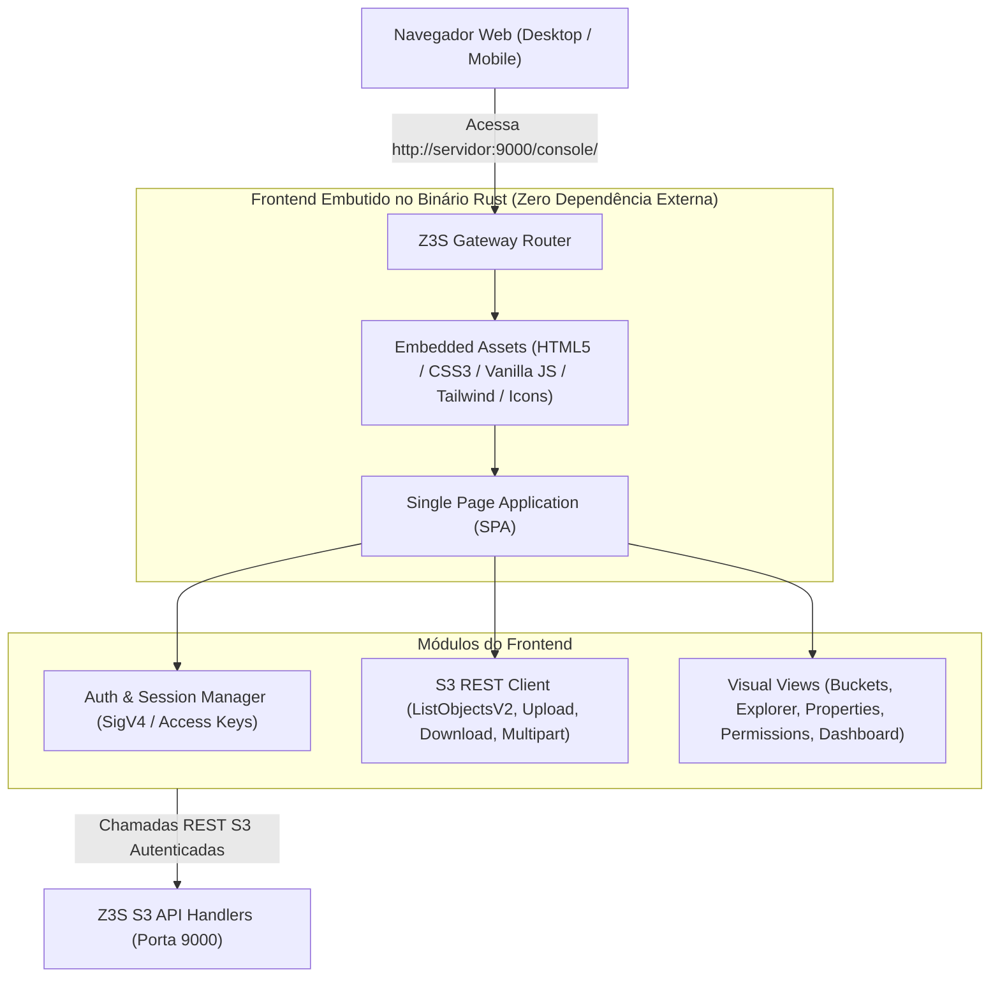
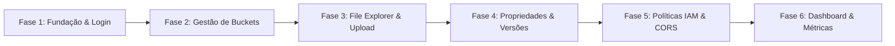

# Roadmap de Desenvolvimento: Z3S Web Console (Interface Gráfica)

**Objetivo:** Desenvolver uma interface gráfica web moderna, intuitiva, responsiva e de alta performance, inspirada no **AWS S3 Management Console**, embutida diretamente no servidor Z3S sem necessidade de runtime Node.js em produção.

---

## 🏗️ 1. Arquitetura da Interface Web

### Características Técnicas do Frontend:
- **Zero Dependências em Produção:** Assets embutidos diretamente no binário Rust (`z3s-server`). O servidor entrega a interface na rota `/console/` sem necessidade de Nginx ou Node.js.
- **Design System Moderno:** Visual limpo, responsivo, com suporte a **Dark Mode** e **Light Mode**, alta densidade de dados e animações fluidas.
- **Cliente S3 Nativo em JavaScript:** Executa chamadas autenticadas com *SigV4* ou tokens de sessão diretamente contra os endpoints REST do Z3S.
- **Upload com Drag & Drop e Streaming:** Suporte a upload de múltiplos arquivos em paralelo com barra de progresso em tempo real e *Multipart Upload* para arquivos grandes.

---

## 🗺️ 2. Fases de Execução do Roadmap

---

### 📌 Fase 1: Fundação, Autenticação & Gateway Embutido
- [x] **1.1. Servidor de Assets Estáticos Embutidos:**
  - Configurar rota `/console` e `/console/*` no `z3s-gateway` para servir a SPA HTML/CSS/JS diretamente da memória.
- [x] **1.2. Tela de Autenticação / Login:**
  - Login com `Access Key ID` e `Secret Access Key`.
  - Armazenamento seguro de sessão criptografada no `sessionStorage`/`localStorage`.
  - Botão de logout e auto-redirecionamento para sessão expirada.
- [x] **1.3. Layout Base & Design System:**
  - Barra de navegação lateral (Sidebar) expansível/retrátil.
  - Header superior com indicador de status do nó, seletor de tema (**Dark / Light Mode**) e menu de usuário.
  - Sistema de notificações Toast (sucesso, erro, alerta, progresso).

---

### 📌 Fase 2: Painel de Gerenciamento de Buckets (Buckets View)
- [x] **2.1. Listagem Geral de Buckets:**
  - Consumir `GET /` (`ListAllMyBuckets`) e renderizar tabela interativa.
  - Campo de busca e filtro de buckets em tempo real com contador dinâmico.
  - Seleção múltipla (Checkboxes, Select All) com barra de ações em lote.
  - Cópia com 1 clique da S3 URI (`s3://bucket-name`) e ARN para clipboard.
  - Colunas: Nome do Bucket, Região (`us-east-1`), Status de Acesso, Data de Criação e Ações.
- [x] **2.2. Modal "Create Bucket" Avançado:**
  - Assistente de criação de bucket com validação de nomenclatura S3 (minúsculas, sem caracteres especiais, 3 a 63 caracteres).
  - Opção para habilitar/desabilitar Versionamento no momento da criação.
  - Seleção de Criptografia padrão (SSE-S3 AES-256 vs SSE-KMS).
  - Configuração de Block Public Access.
- [x] **2.3. Modal "Delete Bucket" com Trava de Segurança:**
  - Confirmação de segurança exigindo digitar exatamente o nome do bucket antes da exclusão.
  - Tratamento de erro quando o bucket contém objetos (`BucketNotEmpty`) com atalho direto para esvaziar.
- [x] **2.4. Modal "Empty Bucket" (Esvaziamento Seguro):**
  - Confirmação exigindo digitar `"permanently delete"`.
  - Exclusão recursiva de todos os objetos e versões do bucket em lote (`DeleteObjects`).
- [x] **2.5. Alternador de Versionamento em Tempo Real:**
  - Consulta e modificação direta do status de Versionamento (`Enabled` / `Suspended`) na aba *Properties*.

---

### 📌 Fase 3: Navegador de Arquivos & Upload (Objects Explorer)
- [ ] **3.1. Navegador de Pastas Virtuais & Breadcrumbs:**
  - Consumir `GET /{bucket}?list-type=2&delimiter=/&prefix={caminho}` (`ListObjectsV2`).
  - Renderizar trilha de navegação clicável (`s3://meu-bucket / pasta1 / pasta2 /`).
  - Listagem com ícones temáticos para pastas, imagens, vídeos, documentos, áudios e arquivos compactados.
- [ ] **3.2. Modal de Upload Drag & Drop:**
  - Área interativa para arrastar e soltar múltiplos arquivos ou selecionar pastas inteiras.
  - Fila de upload com cálculo de progresso individual e total em tempo real.
  - Suporte automático a *Multipart Upload* para arquivos grandes (> 5 MB).
- [ ] **3.3. Ações de Objetos:**
  - **Download:** Download direto de arquivos.
  - **Visualização Rápida (Preview Modal):** Pré-visualização integrada no navegador para imagens, PDFs, arquivos de texto/código, áudios e vídeos.
  - **Criar Pasta:** Modal para criação de pastas virtuais (`PUT /{bucket}/{pasta}/`).
  - **Exclusão Individual e em Massa:** Seleção múltipla via checkboxes com exclusão em lote (`Multi-Object Delete`).
  - **Copiar / Mover / Renomear:** Operações de cópia e renomeação via `x-amz-copy-source`.

---

### 📌 Fase 4: Propriedades, Versionamento e URLs Pré-assinadas
- [ ] **4.1. Aba de Propriedades do Bucket (Properties Tab):**
  - **Versionamento:** Alternador visual (*Toggle Switch*) para Ativar ou Suspender o versionamento do bucket.
  - **Criptografia Padrão:** Visualização e seleção do modo de criptografia (**SSE-S3** ou **SSE-KMS** com AES-256-GCM).
  - **Object Lock & WORM:** Indicador de Legal Hold e modo de retenção (Compliance / Governance).
- [ ] **4.2. Histórico de Versões no File Explorer:**
  - Botão de alternância "Show Versions" (Exibir Versões).
  - Listagem de todas as versões históricas de cada objeto, marcadores de deleção (*Delete Markers*) e opção de restauração rápida.
- [ ] **4.3. Gerador de URLs Pré-assinadas (Presigned URLs):**
  - Modal interativo para gerar link temporário de download seguro com tempo de expiração configurável (15 min, 1 hora, 1 dia).
  - Botão de cópia rápida para a área de transferência.

---

### 📌 Fase 5: Permissões, Políticas IAM & Editor de Bucket Policies
- [ ] **5.1. Aba de Permissões do Bucket (Permissions Tab):**
  - Configuração visual de **Block Public Access** (Bloqueio de acesso público).
  - Configuração de regras de **CORS** (Cross-Origin Resource Sharing) com editor JSON.
- [ ] **5.2. Editor Interativo de Bucket Policy:**
  - Editor de código JSON com realce de sintaxe (*Syntax Highlighting*) e validação de erros em tempo real.
  - Biblioteca de modelos pré-configurados prontos para aplicar:
    - *Acesso Somente Leitura Público (Public Read-Only)*
    - *Acesso Restrito por Faixa de IP (IP Whitelist)*
    - *Acesso Somente com Criptografia Obrigatória (Enforce HTTPS/SSE)*
  - Botões para Testar, Salvar e Aplicar a política diretamente via API S3.

---

### 📌 Fase 6: Dashboard de Monitoramento & Métricas em Tempo Real
- [ ] **6.1. Painel Geral de Métricas do Storage:**
  - Gráficos de pizza e barras mostrando espaço utilizado vs. livre no disco `/mnt/dados`.
  - Contadores em tempo real: Total de Buckets, Total de Objetos, Total de Bytes Armazenados.
  - Taxa de requisições recentes (RPS) e distribuição de operações (GET vs. PUT vs. DELETE).
- [ ] **6.2. Monitor de Saúde dos Nós & Auto-Healing:**
  - Status de integridade dos Extents de armazenamento e registros do WAL.
  - Indicador visual do *Bitrot Scrubber* e última reconstrução Reed-Solomon realizada.
- [ ] **6.3. Testes End-to-End da Interface:**
  - Validação de fluxos completos na interface em navegadores Chrome, Firefox, Safari e Edge (Desktop e Mobile).
